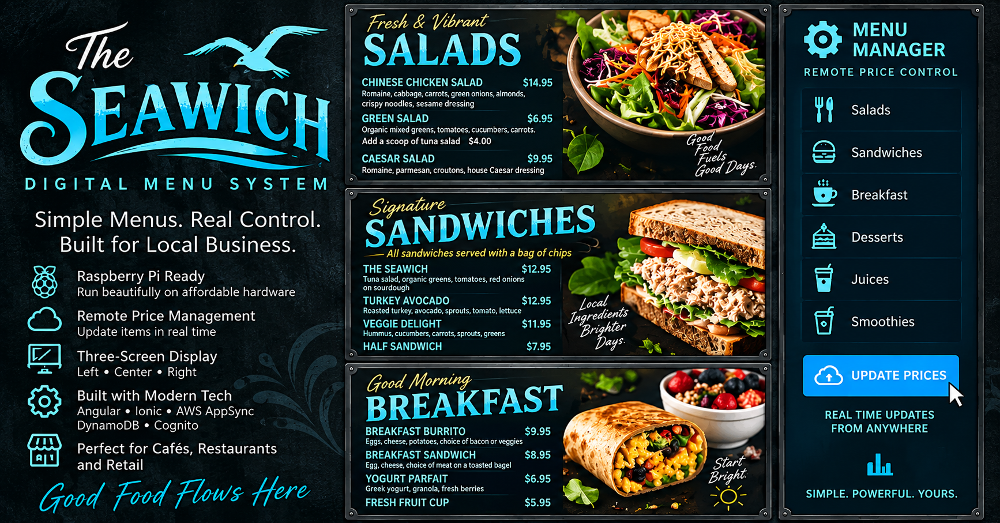

# The Seawich — Digital Menu System

  

  <strong>A cloud-connected digital menu and remote price-management system designed for Raspberry Pi signage.</strong>

  
  
  
  
  
  

---

## Overview

**The Seawich** is a full-stack digital signage and menu-management system designed for restaurants, cafés, and similar businesses.

The system separates customer-facing digital menu displays from an administrative price-management interface. Menu screens can run continuously on Raspberry Pi-connected displays while authorized users manage pricing remotely through a browser.

Menu data is persisted through AWS AppSync and Amazon DynamoDB and consumed by the Angular/Ionic application.

This project was originally developed for a real restaurant deployment and has been converted into a fictionalized portfolio demonstration.

---

## Live Demo

### Digital Menu Displays

| Display | Demo |
| --- | --- |
| Left Menu | https://main.d26v2pfw328oke.amplifyapp.com/menu/left |
| Center Menu | https://main.d26v2pfw328oke.amplifyapp.com/menu/center |
| Right Menu | https://main.d26v2pfw328oke.amplifyapp.com/menu/right |
| Alternate Right Menu | https://main.d26v2pfw328oke.amplifyapp.com/menu/altright |

### Price Manager

https://main.d26v2pfw328oke.amplifyapp.com/auth/login

The management interface demonstrates authenticated remote price management using Amazon Cognito, AWS AppSync, GraphQL, and DynamoDB.

---

## System Architecture

    ┌────────────────────────┐
    │   Administrative UI    │
    │     Price Manager      │
    └───────────┬────────────┘
                │
                │ Cognito Authentication
                ▼
    ┌────────────────────────┐
    │      AWS AppSync       │
    │       GraphQL API      │
    └───────────┬────────────┘
                │
                ▼
    ┌────────────────────────┐
    │    Amazon DynamoDB     │
    │       Menu Data        │
    └───────────┬────────────┘
                │
                ▼
    ┌────────────────────────┐
    │    Angular + Ionic     │
    │   Digital Menu App     │
    └───────────┬────────────┘
                │
                ▼
    ┌────────────────────────┐
    │      Raspberry Pi      │
    │    Signage Displays    │
    └────────────────────────┘

The browser-based menu application allows the display hardware to remain lightweight while the application state and pricing data are managed centrally in AWS.

---

## Technology Stack

| Layer | Technology |
| --- | --- |
| Frontend | Angular 15 |
| UI Framework | Ionic 6 |
| Language | TypeScript |
| API | AWS AppSync |
| API Protocol | GraphQL |
| Database | Amazon DynamoDB |
| Authentication | Amazon Cognito |
| Cloud Integration | AWS Amplify |
| Hosting / CI/CD | AWS Amplify Hosting |
| Hardware Target | Raspberry Pi |
| Source Control | Git / GitHub |

---

## Key Features

### Multi-Screen Digital Signage

The application exposes independent routes for multiple physical menu displays:

    /menu/left
    /menu/center
    /menu/right
    /menu/altright

Each Raspberry Pi display can therefore launch directly into the menu view intended for that screen.

### Remote Price Management

Menu pricing is stored as data rather than embedded permanently in the visual design.

An authorized user can update prices through the management interface without:

- modifying source code
- rebuilding menu artwork
- physically accessing the display hardware
- redeploying the frontend for routine price changes

### Cloud-Backed Menu Data

AWS AppSync provides the GraphQL API between the frontend and DynamoDB.

The principal menu models are:

    LeftMenu
    CenterMenu
    RightMenu

### Authentication

Amazon Cognito provides authentication for the administrative price-management workflow.

The customer-facing menu displays remain separate from the management interface.

### Raspberry Pi Signage

The frontend was designed for browser-based presentation on Raspberry Pi hardware connected to digital displays.

This keeps the signage client simple while allowing application logic and data management to remain cloud-connected.

### Continuous Deployment

The GitHub `main` branch is connected to AWS Amplify Hosting.

Changes pushed to the repository can be automatically built and deployed to the hosted application.

---

## Project Structure

    src/
    ├── app/
    │   ├── auth/
    │   ├── login/
    │   │   └── models/
    │   └── menu/
    │       ├── left/
    │       ├── center/
    │       ├── right/
    │       └── right-alt/
    ├── assets/
    │   ├── branding/
    │   ├── food/
    │   └── social/
    └── graphql/

    amplify/
    └── backend/
        ├── api/
        └── auth/

The individual menu routes allow the same application to support a multi-display installation without maintaining separate applications for each screen.

---

## AWS Backend

The application uses an AWS Amplify Gen 1 backend.

### AWS AppSync

AppSync exposes the GraphQL API used to retrieve and update menu data.

### Amazon DynamoDB

DynamoDB provides persistent storage for menu pricing and related application data.

### Amazon Cognito

Cognito provides authentication for the administrative interface.

### AWS Amplify

Amplify manages the application's AWS integration and hosted deployment workflow.

---

## Local Development

### Prerequisites

Install:

- Node.js
- npm
- Angular CLI
- Ionic CLI
- AWS Amplify CLI

### Clone

    git clone git@github.com:MatthewCoatney/k105k.git
    cd k105k

### Install dependencies

    npm install

### Start the development server

    npm start

### Production build

    npm run build

The browser build is generated at:

    dist/app/browser

---

## Deployment

The application is deployed through AWS Amplify Hosting from the `main` branch.

The Amplify build configuration is:

    version: 1
    frontend:
      phases:
        preBuild:
          commands:
            - npm ci
        build:
          commands:
            - npm run build
      artifacts:
        baseDirectory: dist/app/browser
        files:
          - '**/*'
      cache:
        paths:
          - node_modules/**/*

A successful push to `main` triggers the Amplify deployment pipeline.

---

## Design and Migration

The digital menu screens use detailed SVG-based layouts originally created for large-format restaurant signage.

For the portfolio edition, the application was converted into the fictional **The Seawich** brand while preserving the underlying engineering.

The portfolio conversion included:

- replacing proprietary restaurant branding
- fictionalizing location-specific menu names
- replacing food photography
- centralizing application branding assets
- migrating AWS backend resources
- restoring menu data in DynamoDB
- preserving the existing AppSync data model
- configuring Cognito authentication
- configuring Amplify Hosting
- adding application and social-sharing metadata
- cleaning legacy design and export artifacts

The result preserves the functional system while separating the portfolio demonstration from the original restaurant identity.

---

## Engineering Decisions

### Presentation and Data Are Separated

Menu layouts define how information is presented, while prices are maintained independently as cloud-backed data.

That separation allows routine business changes without redesigning or rebuilding the signage.

### One Application, Multiple Displays

Each display has its own route rather than requiring an independent application build.

This reduces deployment complexity and keeps the signage system maintainable.

### Remote Administration

The price-management workflow removes the requirement for direct access to Raspberry Pi hardware when menu pricing changes.

### Managed AWS Services

AppSync, DynamoDB, Cognito, and Amplify provide the API, persistence, authentication, and deployment layers without requiring a conventional always-on application server.

### Infrastructure Stability

Some internal AWS resource identifiers retain legacy names.

Those identifiers are implementation details rather than customer-facing branding, and unnecessary renaming would introduce migration risk without improving application functionality.

---

## Portfolio Context

The Seawich demonstrates an end-to-end solution spanning:

**Digital signage → Angular/Ionic frontend → authentication → GraphQL → DynamoDB → AWS deployment → Raspberry Pi hardware**

The project is intended to demonstrate more than a static interface. It represents a working system in which frontend software, cloud infrastructure, persistent data, authentication, deployment automation, and physical display hardware operate as parts of one solution.

---

## Repository Notes

This repository contains a portfolio demonstration derived from an earlier production-oriented project.

The restaurant identity, menu names, imagery, and other presentation elements have been fictionalized for public demonstration.

AWS credentials, secrets, private configuration, and production customer information should never be committed to this repository.

---

## Author

**Matthew Coatney**

Software Engineer / AWS Developer

GitHub: https://github.com/MatthewCoatney

Portfolio: https://matthewcoatney.dev

---

  <strong>The Seawich</strong> 
  Digital menus. Remote management. Cloud-backed infrastructure.

